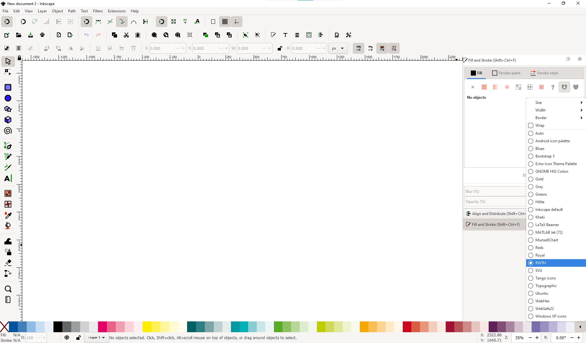

This is a GIMP Palette file with the colors of the [official RWTH Color Palette](https://www9.rwth-aachen.de/global/show_document.asp?id=aaaaaaaaaadpbhq).

I made this to easily access the colors in Inkscape. To do this, copy `RWTH.gpl` to the user palettes folder set in the preferences (`ctrl+shift+P`): `‣ Preferences ‣ System: User palettes`.

After restarting Inkscape you can select it in the color palette selector on the bottom right.

